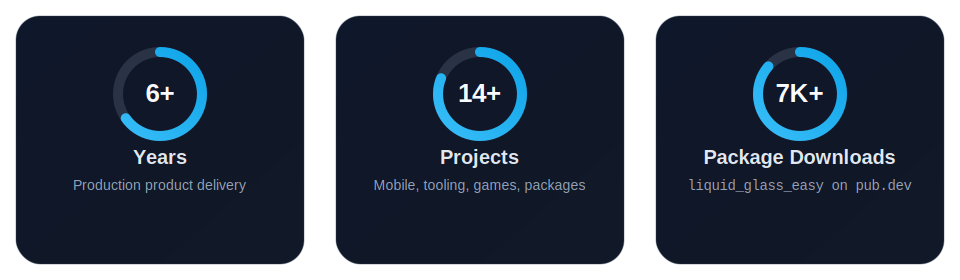
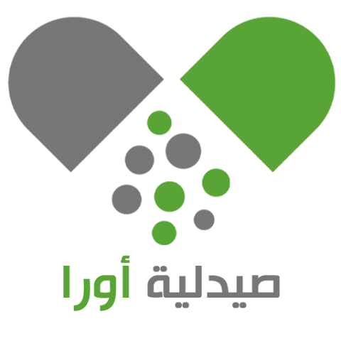

<div align="center">


```
 ┌─────────────────────────────────────────────────────────┐
 │  I build mobile apps that ship, AI systems that think,  │
 │  and developer tools that save time.                    │
 └─────────────────────────────────────────────────────────┘
```


<br/>


<br/>

[](https://github.com/AhmeedGamil)
[](https://www.linkedin.com/in/ahmed-gamil-630980218/)
[](mailto:ahmed.gamil.codes@gmail.com)

</div>

<br/>

<div align="center">

```yaml
# ━━━━━━━━━━━━━━━━━━━━━━━━━━━━━━━━━━━━━━━━━━━━━━━━━━━━━━━━━━━━━━
#  PROFILE MODE
# ━━━━━━━━━━━━━━━━━━━━━━━━━━━━━━━━━━━━━━━━━━━━━━━━━━━━━━━━━━━━━━

role:
  - AI Systems Engineer
  - Software Architect
  - Mobile Developer

base: Sana'a, Yemen

current_focus:
  - Production products across mobile, games, and developer tooling
  - AI infrastructure, RAG, memory, and MCP systems
  - Compiler-style generation, code intelligence, and structured workflows
  - Clean architecture, scalable UX, and failure-resistant system design

highlights:
  - Published Flutter package with 7,000+ downloads
  - Built mobile commerce apps, AI tooling, code retrieval systems
  - Shipped game work with Unity

ai_workflow_stack:
  primary:   Claude Code Opus 4.6
  secondary: Codex ChatGPT 5.3

motto: "Build useful systems. Keep them fast, clean, and reliable."
```

</div>

---

## 📊 At a Glance

<div align="center">



</div>

---

## 🗺️ Journey

<div align="center">

<pre align="center">
╔══════════════════════════════════════════════════════╗
║                       ROADMAP                       ║
╚══════════════════════════════════════════════════════╝

2020
│
▼
Began building video games
as a solo Unity developer
│
▼
2020–2023
│
▼
Built games independently using Unity,
C#, and game-focused systems thinking
│
▼
2021
│
▼
Graduated in Information Technology
Engineering
│
▼
2023
│
▼
Expanded into Flutter and AI engineering
│
▼
2023–Present
│
▼
Building production mobile apps, developer tools,
code intelligence systems, RAG pipelines, and AI
infrastructure
</pre>

<br/>

[](https://github.com/AhmeedGamil)
[](https://github.com/AhmeedGamil)

</div>

---

## 🧰 Core Stack

<div align="center">

### 📱 Mobile


### 🤖 AI Engineering


### 🎮 Games & Native


### ⚙️ Backend


### 🛠️ Tools


### 🧠 AI Workflow


</div>

---

## 🚀 Selected Builds

<div align="center">

> **Featured Start Order**
>
> `1.` [liquid_glass_easy](https://pub.dev/packages/liquid_glass_easy) &nbsp;·&nbsp;
> `2.` [Hamsa](https://github.com/AhmeedGamil/hamsa) &nbsp;·&nbsp;
> `3.` Bolt AI &nbsp;·&nbsp;
> `4.` [Memory System for AI](https://github.com/AhmeedGamil/memory_system_for_ai)
>
> *Other listed projects are private repositories.*

</div>

<br/>

### ✨ [liquid_glass_easy](https://pub.dev/packages/liquid_glass_easy)

> Number one cross-platform Flutter package for interactive liquid glass effects with **7,000+ downloads** on pub.dev.
> [→ View on pub.dev](https://pub.dev/packages/liquid_glass_easy)

---

<details open>
<summary><b>📱 Mobile Projects</b></summary>

<br/>

###  [Moka Sweets](https://play.google.com/store/apps/details?id=com.mokasweets.user)
> Production e-commerce app where I patched critical security, maps, and performance issues for a large live user base.
> [→ View on Google Play](https://play.google.com/store/apps/details?id=com.mokasweets.user)

###  [Hamsa](https://github.com/AhmeedGamil/hamsa)
> Large-scale beauty and makeup shopping platform serving Saudi Arabia, Yemen, Oman, and UAE with isolated data, pricing, and currency.
> Built guest cart merge, secure multi-step checkout, and market-specific payment flows.
> Delivered glass morphism UI, hero animations, RTL Arabic support, real-time order tracking, and push notifications.

###  [Alhamzi](https://github.com/AhmeedGamil/alhmazi)
> Premium fashion shopping app with polished browse-to-checkout flows.
> Added search, filters, wishlist, secure checkout, real-time tracking, and push notifications.
> Built smooth glass morphism UI and full RTL Arabic support.

###  [Aura Pharmacy](https://play.google.com/store/apps/details?id=com.otek.aurapharma&hl=ar)
> Implemented shared cart feature enabling multiple users to collaborate on a single pharmacy order.
> [→ View on Google Play](https://play.google.com/store/apps/details?id=com.otek.aurapharma&hl=ar)

###  [Biqalati](https://play.google.com/store/apps/details?id=com.otek.bigalati&hl=ar)
> Grocery and daily essentials e-commerce app with fast product browsing, cart management, and real-time order tracking.
> [→ View on Google Play](https://play.google.com/store/apps/details?id=com.otek.bigalati&hl=ar)

###  [Alam Semsem Toys](https://play.google.com/store/apps/details?id=com.otek.semsem&hl=t)
> Improved location storage and fixed currency switching through REST API optimization.
> [→ View on Google Play](https://play.google.com/store/apps/details?id=com.otek.semsem&hl=t)

###  [Uturn Food Ordering](https://play.google.com/store/apps/details?id=com.otekit.uturn)
> Integrated custom real-time push notifications for order status updates.
> [→ View on Google Play](https://play.google.com/store/apps/details?id=com.otekit.uturn)

### 🔌 RSA E-Commerce
> Electronics commerce app for Arduino boards, microcontrollers, and maker hardware.
> Added dynamic language and currency switching, secure payments, and real-time backend sync.

</details>

---

## 🤖 AI & Developer Systems

<details>
<summary><b>⚡ Bolt AI — Flutter Clean Code Generator Using Compiler Architecture</b></summary>

<br/>

```text
╔══════════════════════════════════════════════════════════════╗
║  THE IDEA                                                    ║
║                                                              ║
║  Most AI code generation tools produce raw code directly     ║
║  from prompts. Bolt AI treats Flutter generation like a      ║
║  real compiler problem: blueprint in → validated arch out.   ║
╚══════════════════════════════════════════════════════════════╝
```

```text
CORE PIPELINE
─────────────────────────────────────────────────────────────
  YAML Blueprint  →  Parse  →  Validate  →  Transform
                                                    ↓
                              Production-ready Flutter code
                                                    ↑
                                               Emit  ←
```

```text
INTERNAL STRUCTURE
─────────────────────────────────────────────────────────────
  lib/compiler/
  ├── ir/              Intermediate Representation
  ├── parsers/         YAML + JSON blueprint parsing
  ├── validators/      semantic + architecture validation
  ├── transformers/    IR transformation layer
  ├── emitters/        19 code emitters
  ├── pipeline/        orchestration and factories
  └── compiler.dart    entry point
```

```text
GENERATED FEATURE SHAPE
─────────────────────────────────────────────────────────────
  lib/features/product/
  ├── domain/
  │   ├── entities/
  │   ├── repositories/
  │   └── usecases/
  ├── data/
  │   ├── models/
  │   ├── datasources/
  │   └── repositories/
  ├── presentation/
  │   └── bloc/
  ├── di/
  ├── product.dart
  └── product_registry.dart
```

- Built around an Intermediate Representation — reasons about structure before generating Dart files.
- Semantic validators check types, duplicates, naming rules, reserved keywords, and required fields.
- Architecture validators enforce clean architecture boundaries, repository rules, use-case design, and presentation-layer consistency.
- Emitter layer generates entities, models, repositories, data sources, BLoC files, DI modules, registries, endpoints, and barrel files.
- Supports single-feature compilation and batch generation across multiple blueprints.
- Exposes compiler operations through MCP tools: `compile_blueprint`, `validate_blueprint`, `list_blueprints`, and `preview_ir`.
- Turns Flutter clean architecture from repetitive manual setup into a reproducible compiler workflow.

</details>

<details>
<summary><b>🧠 <a href="https://github.com/AhmeedGamil/memory_system_for_ai">Memory System for AI</a></b></summary>

<br/>

```text
╔══════════════════════════════════════════════════════════════╗
║  THE IDEA                                                    ║
║                                                              ║
║  Most AI assistants forget useful context between runs or    ║
║  rely on one flat memory store. This system models memory    ║
║  the way humans do: episodic, semantic, and procedural.      ║
╚══════════════════════════════════════════════════════════════╝
```

```text
SYSTEM STRUCTURE
─────────────────────────────────────────────────────────────
  MCP Client  →  mcp_memory_server.py  →  MemoryManager
                                              ├── VectorEngine      episodic memory
                                              ├── StructuredStore   semantic memory
                                              └── FileStore         procedural memory
```

```text
MEMORY HIERARCHY
─────────────────────────────────────────────────────────────
  Episodic Memory
  ├── storage: ChromaDB
  └── use: experiences, lessons, summaries

  Semantic Memory
  ├── storage: SQLite
  └── use: facts, preferences, project details

  Procedural Memory
  ├── storage: Markdown files
  └── use: patterns, skills, reusable workflows
```

```text
RETRIEVAL MODEL
─────────────────────────────────────────────────────────────
  Memory  →  question embedding
          →  answer embedding

  Query  →  search both indexes
         →  merge matches
         →  return compact relevant memory
```

- Dual-index Q&A search — a memory can be retrieved whether the query matches the question or answer side.
- Episodic memory powered by vector search, semantic memory by structured facts, procedural memory by file-based patterns and skills.
- Uses Sentence-Transformers `all-mpnet-base-v2` embeddings and token-efficient retrieval.
- Includes project tagging, similarity thresholds, fact indexing, and stateless tool design.
- Exposes 20+ MCP tools for storing, recalling, deleting, and managing memories, skills, and patterns.
- Compatible with Cursor, Claude Desktop, Kiro, Antigravity, and other MCP clients.
- Makes long-running AI assistants more reliable through structured memory instead of raw context accumulation.

</details>

<details>
<summary><b>🔍 AST-Based Code RAG — Flutter / Laravel</b></summary>

<br/>

```text
╔══════════════════════════════════════════════════════════════╗
║  THE IDEA                                                    ║
║                                                              ║
║  Standard code RAG splits source files like text documents.  ║
║  This project treats code as structured logic with           ║
║  relationships, flow, metadata, and audience-aware retrieval.║
╚══════════════════════════════════════════════════════════════╝
```

```text
INDEXING FLOW
─────────────────────────────────────────────────────────────
  Source Files  →  AST Parser  →  Structured Extraction
                                          ↓
                              Cross-file Analysis
                                          ↓
                              LLM Enrichment  →  3 Named Vectors  →  Qdrant
```

```text
CHUNK MODEL                        PER-CHUNK REPRESENTATION
──────────────────────────         ──────────────────────────────────────
  One point per:                   Chunk
  ├── class method                 ├── description vector
  ├── standalone function          ├── developer-questions vector
  ├── class-level unit             ├── user-questions vector
  └── config / route block         ├── calls / called_by
                                   ├── routes / models / tables
  Never whole-file chunks          └── raw source payload
  Never mid-function splits
```

```text
QUERY FLOW
─────────────────────────────────────────────────────────────
  User question  →  query expansion  →  vector + BM25 hybrid retrieval
                                                    ↓
                                          merge + rerank
                                                    ↓
                                      call-graph expansion
                                                    ↓
                                        context builder  →  final answer
```

- Closes the semantic gap at index time, not query time.
- Stores enriched semantic descriptions, developer questions, user questions, and graph relationships — raw source kept in payload for answer-time context.
- Retrieval combines dense vectors with BM25 hybrid search, then expands through `calls` and `called_by` neighbors for flow awareness.
- Each chunk carries rich payload metadata: parameters, return types, visibility, routes, models, tables, git blame, and commit history.
- Qdrant used with named vectors and payload-aware search; incremental re-indexing keeps the index current.
- Includes a RAGAS-style evaluation setup using LLM-as-judge scoring for faithfulness, relevancy, precision, and recall.
- Designed for serious codebase understanding across frameworks such as Laravel and multi-project retrieval workflows.

</details>

<details>
<summary><b>🧬 DNA-Inspired Multi-Agent Architecture</b></summary>

<br/>

```text
╔══════════════════════════════════════════════════════════════╗
║  THE IDEA                                                    ║
║                                                              ║
║  Most multi-agent systems use optional pipelines:            ║
║  planner → coder → reviewer.                                 ║
║  This project asks: what if agent relationships were         ║
║  structurally enforced, the same way DNA base pairing        ║
║  is enforced in biology?                                     ║
╚══════════════════════════════════════════════════════════════╝
```

```text
AGENT MAPPING
─────────────────────────────────────────────────────────────
  A = Architect       T = Tester
  G = Generator       C = Critic
```

```text
TWO-STRAND MODEL
─────────────────────────────────────────────────────────────
  Generative strand:     A ──────────► G
                         │             │
  Verification strand:   T ◄────────── C

  A pairs with T  ·  G pairs with C  ·  Pairing is mandatory
```

```text
SYSTEM FLOW
─────────────────────────────────────────────────────────────
  Raw input
      → A builds structured specification
      → T validates specification
      → G generates from verified spec
      → C critiques against that spec
      → Merge mechanism
      → Final output
```

```text
SEQUENCE-AS-CONFIGURATION
─────────────────────────────────────────────────────────────
  ATGC  →  analyze-first        GCAT  →  generative-first
  TACG  →  constraint-driven    CGTA  →  adversarial-first

  Same agents · Different reasoning strategy
```

- Maps DNA base-pairing rules into an AI collaboration model where complementary roles are enforced at the architecture level.
- A-T acts as the fast structural pair for requirements and validation; G-C acts as the deeper generation and critique pair.
- Key architectural rule: silence is invalid — critique is mandatory and generation is tied to a verified specification.
- Creates a parallel dual-track reasoning model instead of a loose sequential pipeline.
- The sequence itself becomes a programmable reasoning layer — same four agents, different cognitive strategies.
- Includes experiment artifacts and scored runs comparing structured DNA-style reasoning against other approaches.
- One of the clearest examples of thinking about AI systems: not just prompts and agents, but rules, structure, constraints, and failure-resistant collaboration.

</details>

---

## 📦 Published Work

<div align="center">

| Project | Description | Link |
|:--------|:------------|:-----|
| ✨ **liquid_glass_easy** | #1 cross-platform Flutter package for interactive liquid glass effects · 7,000+ downloads | [pub.dev](https://pub.dev/packages/liquid_glass_easy) |
| 🎮 **Keep Flip** | Paid Steam puzzle game built with Unity and fluid-physics gameplay | [Steam](https://store.steampowered.com/app/2550340/Keep_Flip/) |
| 🏆 **Implant Mission** | Audience Choice Award winner in a game jam | — |

</div>

---

## 📬 Contact

<div align="center">

<h3><em>Got a mobile app that needs to ship or an AI system that needs to think?</em></h3>
<h3><em>Let's talk — I'm always up for solving real problems with well-built systems.</em></h3>

<br/>

[](https://github.com/AhmeedGamil)
[](https://www.linkedin.com/in/ahmed-gamil-630980218/)
[](mailto:ahmed.gamil.codes@gmail.com)

📍 Sana'a, Yemen &nbsp;·&nbsp; 🌐 Arabic (Native) &nbsp;·&nbsp; English (Professional)

</div>
